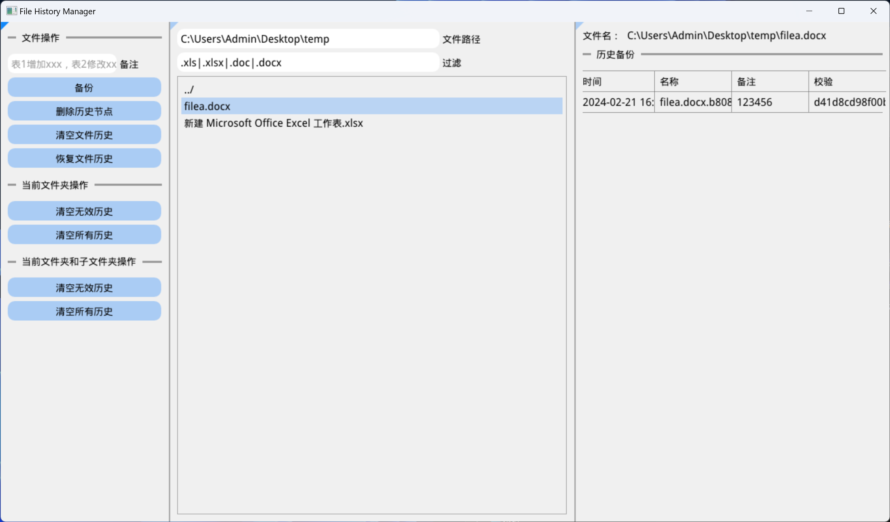

# 文件备份助手

为了方便帮助不会使用Git的人备份文档并管理历史记录，编写了该工具。



## 原理

拷贝要备份的文件到.history目录中，并存储备份时间、MD5值等信息。

## 编译方法

```
xmake
```

参考 xmake.io

## 使用方法

1. 输入文件（夹）目录或者拖拽文件（夹）到程序界面
2. 选中文件，输入备注信息并点击备份按钮，即可备份
3. 双击文件夹可以进入
4. 选中一个历史节点可以删除一个备份
5. 可以通过点击按钮删除当前目录（或包含子目录）下的无效历史（通过文件名来查找）或全部历史

## TODO

- [ ] 一键历史恢复
